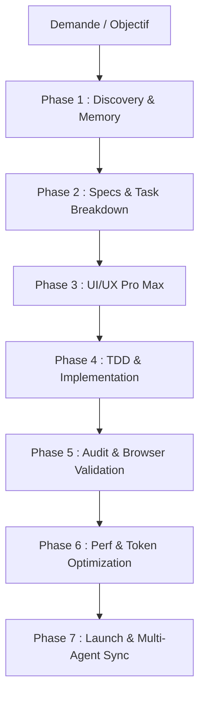

# 🛸 Guide d'Orchestration Automatique — Studio A V2

Ce document détaille le fonctionnement du système automatique d'orchestration
intelligente du workspace **Studio A V2**.

---

## 🎯 Architecture des 7 Phases

L'orchestrateur structure chaque cycle de développement en 7 étapes coordonnées
afin de garantir une qualité industrielle tout en minimisant les coûts en tokens :



---

## 🛠️ Matrice Complète des Skills et Outils

### 1. Discovery & Cartographie de Code

- `skills/understand/` : Cartographie complète du code et graphes de dépendances.
- `skills/understand-domain/` : Extraction de la logique métier et flux opérationnels.
- `skills/understand-explain/` : Explications ciblées des fonctions et modules.
- `skills/understand-dashboard/` : Visualisation interactive du graphe de code.
- `skills/projectmem/` : Mémoire persistante du projet, réduction de 50% des tokens, mémorisation des pièges et décisions.

### 2. Spécification & Cadrage

- `skills/spec-driven-development/` : Définition des contrats et critères de succès.
- `skills/planning-and-task-breakdown/` : Découpage méthodique en tâches unitaires.
- `skills/interview-me/` : Clarification des zones d'ombre par questions ciblées.
- `skills/context-engineering/` : Structuration du contexte et des instructions.

### 3. UI/UX Pro Max & Design System

- `skills/ui-ux-pro-max/` : Standards haut de gamme, palettes HSL, micro-interactions, anti-design générique.
- `skills/design-system/` : Tokens, typographie moderne et bibliothèques de composants.
- `skills/ui-styling/` : Styling CSS moderne, Tailwind, glassmorphism.
- `skills/frontend-ui-engineering/` : Interfaces robustes, accessibles et fluides.
- `skills/brand/`, `skills/banner-design/`, `skills/slides/` : Assets de marque, bannières et présentations.

### 4. Implémentation & TDD

- `skills/test-driven-development/` : Écriture des tests d'abord, garantie de non-régression.
- `skills/incremental-implementation/` : Développement par petits lots vérifiables.
- `skills/code-simplification/` : Élimination de la complexité superflue.
- `skills/api-and-interface-design/` : Conception d'APIs stables et typées.
- `skills/doubt-driven-development/` : Revue contradictoire des décisions critiques.

### 5. Audit & Validation Navigateur

- `skills/understand-diff/` : Analyse prédictive des impacts de changements.
- `skills/browser-testing-with-devtools/` : Validation visuelle, a11y et interactions réelles.
- `skills/code-review-and-quality/` : Audit multi-axes du code avant commit.
- `skills/debugging-and-error-recovery/` : Résolution méthodique de bugs et logs.

### 6. Performance, Sécurité & Tokens

- `skills/token-monitor/` : Télémesure en temps réel des coûts et de l'usage des tokens.
- `skills/performance-optimization/` : Core Web Vitals, chargements et réactivité.
- `skills/security-and-hardening/` : Audit des failles, dépendances et accès.
- `skills/cliproxyapi/` : Passerelle universelle de modèles pour optimiser la résilience.

### 7. Multi-Agent & Déploiement

- `skills/antigravity-orchestrator/` : Routage sémantique et exécution de chaînes de skills.
- `skills/hcom-agent-messaging/` : Communication inter-agents temps réel entre terminaux.
- `skills/promptscript/` : Compilation de la config d'agents vers 50 plateformes.
- `skills/shipping-and-launch/` : Checklists et automatisations de mise en production.
- `skills/ci-cd-and-automation/` : Pipelines CI/CD automatisés.

---

## ⚡ Commandes Rapides

```bash
# Vérifier l'inventaire et les phases actives
npm run status

# Diagnostiquer l'intégrité globale du workspace
npm run health

# Obtenir la recommandation intelligente pour une tâche
npm run route "Créer une landing page moderne avec dark mode"

# Exécuter les pré-vérifications qualité et mémoire
npm run precheck

# Voir les commandes des dashboards graphiques
npm run dashboard
```
