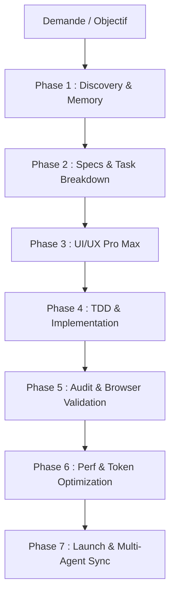

# 🛸 Guide d'Orchestration Automatique — Studio A V2

Ce document détaille le fonctionnement du système automatique d'orchestration intelligente du workspace **Studio A V2**.

---

## 🎯 Architecture des 7 Phases

L'orchestrateur structure chaque interaction de développement en 7 étapes coordonnées afin de garantir une qualité industrielle tout en minimisant les coûts en tokens et le temps de développement :



---

## 🛠️ Matrice Complète des Skills et Outils

### 1. Discovery & Cartographie de Code
- [`skills/understand/`](file://$WORKSPACE/skills/understand) : Cartographie complète du code et graphes de dépendances.
- [`skills/understand-domain/`](file://$WORKSPACE/skills/understand-domain) : Extraction de la logique métier et flux opérationnels.
- [`skills/projectmem/`](file://$WORKSPACE/skills/projectmem) : Mémoire persistante du projet, réduction de 50% des tokens, mémorisation des pièges et décisions.

### 2. Spécification & Cadrage
- [`skills/spec-driven-development/`](file://$WORKSPACE/skills/spec-driven-development) : Définition des contrats et critères de succès.
- [`skills/planning-and-task-breakdown/`](file://$WORKSPACE/skills/planning-and-task-breakdown) : Découpage méthodique en tâches unitaires.
- [`skills/interview-me/`](file://$WORKSPACE/skills/interview-me) : Clarification des zones d'ombre par questions ciblées.

### 3. UI/UX Pro Max & Design System
- [`skills/ui-ux-pro-max/`](file://$WORKSPACE/skills/ui-ux-pro-max) : Standards haut de gamme, palettes HSL, micro-interactions, anti-design générique.
- [`skills/design-system/`](file://$WORKSPACE/skills/design-system) : Tokens, typographie moderne et bibliothèques de composants.
- [`skills/ui-styling/`](file://$WORKSPACE/skills/ui-styling) : Styling CSS moderne, Tailwind, glassmorphism.
- [`skills/brand/`](file://$WORKSPACE/skills/brand), [`skills/banner-design/`](file://$WORKSPACE/skills/banner-design), [`skills/slides/`](file://$WORKSPACE/skills/slides) : Assets de conversion et communication.

### 4. Implémentation & TDD
- [`skills/test-driven-development/`](file://$WORKSPACE/skills/test-driven-development) : Écriture des tests d'abord, garantie de non-régression.
- [`skills/incremental-implementation/`](file://$WORKSPACE/skills/incremental-implementation) : Développement par petits lots vérifiables.
- [`skills/code-simplification/`](file://$WORKSPACE/skills/code-simplification) : Élimination de la complexité superflue.

### 5. Audit & Validation Navigateur
- [`skills/understand-diff/`](file://$WORKSPACE/skills/understand-diff) : Analyse prédictive des impacts de changements.
- [`skills/browser-testing-with-devtools/`](file://$WORKSPACE/skills/browser-testing-with-devtools) : Validation visuelle, a11y et interactions réelles.
- [`skills/debugging-and-error-recovery/`](file://$WORKSPACE/skills/debugging-and-error-recovery) : Résolution méthodique de bugs et logs.

### 6. Performance, Sécurité & Tokens
- [`skills/token-monitor/`](file://$WORKSPACE/skills/token-monitor) : Télémesure en temps réel des coûts et de l'usage des tokens.
- [`skills/performance-optimization/`](file://$WORKSPACE/skills/performance-optimization) : Core Web Vitals, chargements et réactivité.
- [`skills/security-and-hardening/`](file://$WORKSPACE/skills/security-and-hardening) : Audit des failles, dépendances et accès.

### 7. Multi-Agent & Déploiement
- [`skills/hcom-agent-messaging/`](file://$WORKSPACE/skills/hcom-agent-messaging) : Communication inter-agents temps réel entre terminaux.
- [`skills/promptscript/`](file://$WORKSPACE/skills/promptscript) : Compilation de la config d'agents vers 50 plateformes.
- [`skills/shipping-and-launch/`](file://$WORKSPACE/skills/shipping-and-launch) : Checklists et automatisations de mise en production.

---

## ⚡ Commandes Rapides

```bash
# Vérifier l'inventaire et les phases actives
npm run status

# Obtenir la recommandation intelligente pour une tâche
npm run route "Refondre le tunnel d'inscription avec Tailwind et vérifier l'a11y"

# Exécuter les pré-vérifications qualité et mémoire
npm run precheck

# Voir les commandes des dashboards graphiques
npm run dashboard
```
